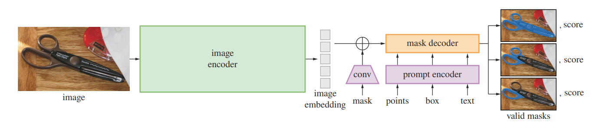

# PlantMap: Federated learning for segmentation, detection, and classification of weed species in aerial images taken from farm fields


## Setup Environment

```
conda create --prefix <path to new conda env> python=3.12
conda activate <path or name>
conda install -c conda-forge huggingface_hub
cd /tmp # or any empty directory
git clone https://github.com/facebookresearch/sam2.git
cd sam2
pip install torch torchvision numpy
pip install -e .
pip install -e ".[notebooks]"
pip install scipy

```

#### Create Masks

```
# Place all images in data/Hyperlapse
mkdir masks
mkdir test_results
python scripts/huggingface_sam_test.py 

```

#### Create Flower Dataset for Unsupervised Classification

```
mkdir masks
conda activate <path or name>
python unsupervised_classification/create_all_flowers.py
```


#### Similarity Matching
Due to laziness, the current code does only compare all flowers of a single picture. 

```
# Run the "Create Flower Dataset for Unsupervised Classification" step
mkdir similarities

conda activate <path or name>
python unsupervised_classification/feature_matching.py
```

------------------------------------------------------------------------------------------------------------------------------------------
### Project members:

Derya Akbaba - Linkoping University <br>
Sofia Andersson - Lund University <br>
Sara karimi - KTH Royal Institute of Technology <br>
Markus Fritzsche - Linkoping University <br>
Xavante Erickson - Lund University and Ericsson<br>

## Introduction
Understanding and managing the biodiversity of farming fields is crucial for sustainable agriculture and efficient resource utilization.
Having accurate information about the composition of wildflowers play an important role in managing the biodiversity achieving more sustainable and efficient farming practices.
But given that wildflowers are small, sparsely scattered in large areas, and have short blooming cycles, tracking the composition using traditional methods are challenging. 

This project aims to create a "plant map" of farm fields by identifying specific plant species at various coordinates, provided using aerial imaging captured by drones.
The resulting map will provide critical insights into plant distribution, enabling farmers to optimize pesticide application and tailor soil mineral combinations for enhanced crop growth. 
Furthermore, the timing of cattle grazing in spring, when critical flora has flowered, significantly impacts both cattle well-being and environmental balance.
So efficiently identify key flora across vast grazing areas and providing real-time statistics to farmers can further reduce the costs and optimizes the release of cattle for grazing which further contribute to efficient farming.
To help this effort, we use machine learning approaches leveraging state-of-the-art computer vision techniques and pre-trained vision models and fine-tune them on datasets collected from farms. To allow farmers' data privacy we employ a federated learning approach where each farmer can have local trainings without the need to share data globally.
We build on prior work by Schouten et al. [1] who contribute an expert-annotated dataset of wildflower images from the Netherlands. We hope can be small contribution towards smarter and more sustainable farming.


## Scalable solution
The main scalable solution in this project is built upon a federated learning architecture, enabling efficient training across distributed datasets while preserving data privacy. 
To support this approach, we leverage the FedN tool, a framework designed for federated learning applications. Below, we provide a brief introduction to federated learning and the FedN tool.

### Federated Learning and FedN

Federated learning (FL) is a decentralized approach to machine learning that allows multiple parties to collaboratively train a shared model without sharing their raw data. This technique is particularly valuable in scenarios where data privacy, security, or locality is critical, such as healthcare, finance, and agriculture.

#### **How Federated Learning Works**
1. **Local Training**: Each participating client (e.g., farmers, edge devices) trains a local model using its private data. This training process occurs independently and securely on each client’s device.
2. **Model Updates**: Once training is complete, each client sends only the model updates (e.g., weights, gradients) to a central server. Importantly, raw data remains on the client’s device, ensuring privacy.
3. **Global Aggregation**: The central server aggregates the updates from all participating clients to create a global model. This global model is then shared back with the clients for the next round of training.
4. **Iterative Process**: Steps 1–3 are repeated for several rounds until the global model converges to a satisfactory performance level.

Federated learning comes with advantages such as **(i) privacy**: as sensitive data never leaves the client’s device, reducing the risk of data breaches, **(ii) scalability**: as it can scale to millions of devices or participants, enabling collaborative training on massive datasets, and **(iii) personalization**: as clients can fine-tune the global model locally to adapt it to their specific data distribution.

#### **Aggregation Methods in Federated Learning**
A critical aspect of FL is the aggregation of model updates to ensure the global model improves with each round. Common aggregation methods include:
- **Federated Averaging (FedAvg)**: A simple yet effective method introduced by Sun et al. [2], where the global model is updated by averaging the weights or gradients received from clients, weighted by the size of each client's dataset.
- **Gradient Aggregation**: In scenarios where gradients are shared, these can be aggregated directly to update the global model.
- **Adaptive Aggregation**: Advanced methods that account for heterogeneity in client data, ensuring that clients with diverse data distributions contribute effectively to the global model.

#### **FedN for Federated Weed Detection**
In this project, we leverage [**FedN**](https://www.scaleoutsystems.com/framework), a robust federated learning framework designed for scalable and efficient model training. Using FedN, we aggregate locally trained models from farmers to create a unified global model for weed detection and classification. Each farmer's model is trained on their specific annotated data (e.g., clovers or chamomiles), and the aggregated model benefits from the diverse local datasets while respecting data privacy.
This approach allows us to build a high-performing foundation model for farm weed detection without compromising individual data security.


## Machine Learning Methods
Since the solution entails performing **image segmentation and object detection/classification** tasks on images, the following sections detail the machine learning approaches employed for each specific task.

### Segmentation of images
Given a collection of raw images, the first step is to perform segmentation to identify and extract potentially interesting regions that contain objects within the images. 
To achieve this, we have explored two distinct approaches: one supervised and the other unsupervised, which we detail further below.

1. **Unsupervised Segmentation** : Segments images into meaningful regions using U2seg (Unsupervised Universal Image Segmentation) model with no labeled data required for further training or fine-tuning of the model.

2. **Supervised Segmentation** : Uses the Segment Anything Model (SAM) for the segmentation task. Training or fine-tuning of the SAM model requires labeled data

#### Unsupervised Segmentation
[U2Seg (Unsupervised Universal Image Segmentation)](https://github.com/u2seg/U2Seg) is a novel approach designed to segment images into meaningful regions without relying on annotated data for training. 
It works by combining two key principles: learning pixel-level representations and clustering them into segments in a fully unsupervised manner. 
The model leverages a vision transformer (ViT) to extract dense features across the image, capturing both local and global context. 
It then applies contrastive learning to make similar pixels in feature space more alike while pushing dissimilar pixels apart, effectively learning the structure of an image. 
Once features are learned, a clustering algorithm groups the pixels into distinct segments, representing objects or regions. 

<p style="text-align: center;">
  
</p>


#### Supervised Segmentation
The [Segment Anything Model (SAM)](https://github.com/facebookresearch/segment-anything) [3] is a foundation model for image segmentation, designed to handle a wide variety of segmentation tasks without the need for task-specific fine-tuning. 
At its core, SAM uses a vision transformer (ViT) backbone to extract rich, hierarchical features from an image. 
These features are then processed by a prompt encoder that allows users to provide inputs in the form of points, bounding boxes, or free-form text, specifying the region of interest to segment. 
SAM combines these prompts with the image features to predict masks through a lightweight mask decoder.

<p style="text-align: center;">
  
</p>

### Classification of objects in the images
With the segmentations in place, we explore two approaches for the classification task:

1. **Unsupervised Classification** : This method relies on template matching to group segments of the original image that match with a given example without requiring labeled data.

2. **Supervised Classification** : This approach utilizes the pre-trained CLIP (Contrastive Language–Image Pretraining) model, leveraging its powerful multi-modal capabilities to classify segments based on learned visual and the provided textual prompts.

#### (Semi-/Un-)supervised Classification
We use SAM in order to get flower images without background as this is usually pretty accurate using a pretrained SAM2 model. 
For every possible wildflower, we select one candidate as reference image. 
We finetune a masked-autoencoder, discard the decoder and use the encoder part of the model to retrieve image features. 

To train the model, we chose to compare two different approaches, [BYOL](https://arxiv.org/abs/2006.07733) [5] and [SimCLR](https://arxiv.org/abs/2002.05709) [6], both methods for learning visual representations. 
An encoder model maps each image into a vector. By normalizing the vector (unit vector) and comparing them using cosine-similarity, we get a probability of both images belonging to the same class or not. 

##### Challenges
* The number of distinct flower classes is comparably low compared to the number of overall images
* Just by looking on the raw data, it is clear that the dataset is not evenly distributed (class imbalance) 
* Many flowers of different classes look similar, e.g., all flowers with white blossoms. 
* SAM is not perfect, i.e., it predicts false positives 


#### Supervised Classification
[CLIP (Contrastive Language–Image Pretraining)](https://github.com/openai/CLIP) [4] is a multimodal model developed by OpenAI that learns to associate images and text through a contrastive learning framework.
It uses two separate neural networks one for images (a vision transformer or CNN) and one for text (transformer-based language model). 
These networks encode images and text into a shared embedding space. 
During training, CLIP is presented with image-text pairs and learns to align their embeddings, so that the embedding of an image is close to its corresponding text description and far from unrelated ones.
This enables CLIP to perform zero-shot tasks: it can recognize and classify images based on textual descriptions without requiring fine-tuning on specific datasets. 


<p style="text-align: center;">
 
 
</p>

### Pre-training
Using the [**Eindhoven Wildflower Dataset (EDW)**](https://dataverse.nl/dataset.xhtml?persistentId=doi:10.34894/U4VQJ6) to finetune the CLIP model on a variety of flowers, the theory was that this might improve performance on the target dataset, as the CLIP model would have seen many more images of flowers than those available in the dataset.
Even if the labels do not overlap fully, they should be close enough in embedding space to hopefully provide the model with a better starting point. 
The models were trained in two ways:
1. **Cross-categorical entropy.** The CLIP model parameters were trained along with a classifier head for the EWD.
2. **Supervised Contrastive Loss.** This is the method that the CLIP model was originally trained with. Images and labels for the EWD were fed into the model and the contrastive loss was then used to update the CLIP weights.


## Datasets
Since we started with an unannotated dataset of raw images, it was necessary to first annotate and label the dataset to generate training data required for training an image object detection and classification model. To achieve this, we used the pre-trained SAM+CLIP approach described in the **Method** section.
Specifically, the raw images were fed into the **SAM** model, which performed segmentation to identify distinct regions in the images. 
These segmented regions were then passed to the **CLIP** model for classification. The CLIP model was provided with a list of textual prompts representing the labels of existing weed species, enabling it to classify each segment according to the specified labels. 
The resulting labeled dataset has over 2000 samples with labels for four weed species **Daisy, Yarrow, Dandelion, and Red clover**. The dataset is published in the HuggingFace dataset repository [PlantMap](https://huggingface.co/datasets/sarakarimi30/PlantMap).

As detailed in the **Pre-training** section, to develop a base model better suited for detection and classification on the above-mentioned dataset, we pre-trained our model on a similar dataset, the EWD dataset. This dataset contains 2,002 high-resolution annotated images of wildflowers, providing a robust starting point for training.


## Experiments & Results

| Max accuracy | Loss     | Retrained? | Optimizer | Learning rate | Batch size | Dropout | First epoch acc |
| ------------ | -------- | ---------- | --------- | ------------- | ---------- | ------- | --------------- |
| 89.3232      | CCE      | True       | SGD       | 0.02          | 32         | 0       | 88.44           |
| 85.4976      | CCE      | False      | SGD       | 0.02          | 32         | 0       | 87.68           |
| 90.2979      | CCE      | True       | SGD       | 0.001         | 32         | 0       | 85.32           |
| 91.411       | CCE      | False      | SGD       | 0.001         | 32         | 0       | 66.51           |
| 86.5553      | Contrast | True       | AdaDelta  | 0.04          | 32         | 0.2     | 72.17           |
| 86.77        | Contrast | True       | AdaDelta  | 0.04          | 32         | 0       | 72.88           |
| 88.67        | Contrast | True       | AdaDelta  | 0.4           | 32         | 0       | 86.78           |
| 90.48        | Contrast | True       | AdaDelta  | 4.5           | 32         | 0       | 85.61           |
| 89.76        | Contrast | True       | AdamW     | 0.008         | 32         | 0.1     | 87.04           |
| 88.61        | Contrast | True       | AdamW     | 0.01          | 32         | 0       | 85.55           |


## Conclusions & Future Work
TODO

## References
[1] Schouten, Gerard, Bas SHT Michielsen, and Barbara Gravendeel. "Data-centric AI approach for automated wildflower monitoring." Plos one 19.9 (2024): e0302958. <br>
[2] Sun, Tao, Dongsheng Li, and Bao Wang. "Decentralized federated averaging." IEEE Transactions on Pattern Analysis and Machine Intelligence 45.4 (2022): 4289-4301. <br>
[3] Kirillov, Alexander, et al. "Segment anything." Proceedings of the IEEE/CVF International Conference on Computer Vision. 2023. <br>
[4] Bianchi, Federico, et al. "Contrastive language-image pre-training for the italian language." arXiv preprint arXiv:2108.08688 (2021). <br>
[5] Grill, Jean-Bastien, et al. "Bootstrap your own latent-a new approach to self-supervised learning." Advances in neural information processing systems 33 (2020): 21271-21284. <br>
[6] Chen, Ting, et al. "A simple framework for contrastive learning of visual representations." International conference on machine learning. PMLR, 2020. <br>